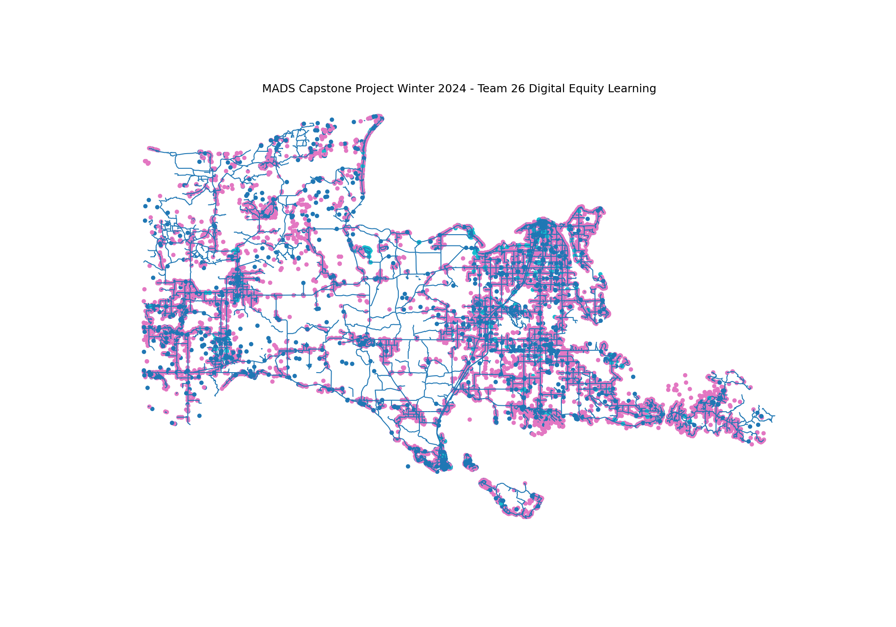

## Digital Equity Learning

Hello World! **We are MADS Capstone Project Team 26**. 

Allow us to introduce ourselves: Te, Osas, and Jason. We’ve been working on the **Digital Equity Learning** project, and it has been quite a journey!

Our adventure began with a qualitative analysis of the Netrics dataset. Our goal was to understand the various attributes related to quality of experience in terms of Internet or network connectivity. Throughout this journey, we’ve learned and applied many skills that we developed during the MADS program.

For data wrangling, we utilized libraries such as Pandas, GeoPandas, Fiona and Shapely. Additionally, we delved into network analysis libraries like NetworkX and OSMNx to gather and analyze network data geospacially. Our unique idea emerged: geospatially representing Internet connections and the supporting infrastructure. We also explored the distribution of higher-quality infrastructure compared to areas with lower-quality infrastructure. We visualized knowledge with Matplotlib and Seaborne.

Our journey didn’t stop there. We conducted statistical analyses, implemented random forests, and used regressors. Through visualizations, we aimed to tell the story of how quality of infrastructure relates to digital equity. Our hope is that the foundational framework we’ve developed can evolve with new data, especially as it becomes continuously available through higher-velocity public sources.

Why did we do this? To accelerate policy interventions, promote digital equity, and foster digital adoption. We believe that everyone should have the opportunity to participate in the digital economy.

We’ve thoroughly enjoyed this project and appreciate the chance to share it with you. Feel free to explore our GitHub repository and read our report. 

Have a fantastic day, and GoBlue!

### To run our code that developed our models and visualizations for our report, clone this repository, setup an evironment with the libraries listed in requirements.txt.

- Data is in the **DATA** folder.
- **Notebooks** folder contains the code that was used for the models and visuals in our report.

